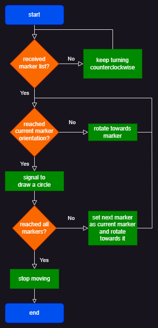

# Experimental robotics laboratory assignment 1
Marker finder and circler program
## installation
to install the program clone this repository inside the src folder of a ROS2 foxy workspace and build it with `colcon build`.
together with the packages here available the program uses the `ros2_aruco` package available here: https://github.com/CarmineD8/ros2_aruco
## running the program
To run this program in the two possible modes two launch files are available:
- marker localization and circling with robot motion: run in a terminal the following command:
`ros2 launch robot_control gazebo_assignment.launch.py`;
- marker localization and circling with camera rotation: run in a terminal the following command:
`ros2 launch robot_control gazebo_camera_assignment.launch.py`.
## structure
The program is composed of 4 packages: 
- `robot_control`: this package contains the launch file to launch the program, the world file, the urdf of the robot and the main nodes (Robot_controller and Camera_controller), tasked to control the robot's wheels (or its camera's rotational joint), transmit the current yaw of the robot (or of the camera's joint) and signal when it is the moment to draw a circle around the markers; both of them have the modifiable parameter `starting_rotation_speed` to modify the starting rotation speed during the first phase (detection of all markers) and the maximum rotation speed during the marker reaching phase;
- `marker_localizer`: here is placed the marker_sorter node, tasked to store, sorted in increasing order of marker IDs, the orientations of the robot (or of the camera) in whih each of the markers is seen for the first time in the camera and transmit them to the main node; the marker IDs are obtained from the aruco node of the ros2_aruco package, the robot/camera orientation is obtained via a custom message from the main node and the sorted orientations are published using another custom message; this node also has the parameter `starting_rotation_speed`, which is used for the estimation of the full lap completion: as such this should have the same value as the `starting_rotation_speed` parameter of the main node when running the program
- `py_cv_marker`: to this package belongs the marker_circler node, tasked to draw a circle around the marker currently in the camera view and publish the resulting image on a custom topic; it is triggered by a message from the main node;
- `targets_interface`: this package contains the two custom messages used to transmit the orientations between the marker sorter and the main nodes: `targets_interface/msg/RobotYaw` and `targets_interface/msg/TargetsYaw`.
## nodes flowchart
Here are the flowchart showing the behaviour of the nodes:
- main nodes (same behaviour, just different topics for control and sensing):

- marker_sorter:

- marker_circler:

## topics created by these nodes
the program, aside from using already created topics from simulation nodes (and from the ros2_aruco aruco_node) creates 4 topics:
- `/images/circled_markers`, type `sensor_msgs/msg/Image`: here the images containing the markers with the (red) circle drawn around them are published by the `marker_circler` node;
- `/current_yaw`, type `targets_interface/msg/RobotYaw`: here the robot/camera orientation measured in the main node is transmitted to the marker_sorter node;
- `/sorted_markers`, type `targets_interface/msg/TargetsYaw`: the marker_sorter uses this topic to send the (sorted by marker ID in increasing order) markers orientation to the main node;
- `/place_circle`, type`std_msgs/msg/Empty`: this topic is used by the main node to signal the marker_circler node to draw a circle around the marker (and then publish the resulting image)
## additional information
The robot_control package is a renaming of the `robot_urdf` package, with the addition of the nodes, the launch files and the world file used for the assignmen and a little modification to the urdf of the robot: a stick 0.1 m tall has been added as a base of the camera to allow the robot to see the markers even in the case in which the robot's wheel would obstruct the camera's view of the markers if left at the previous height.